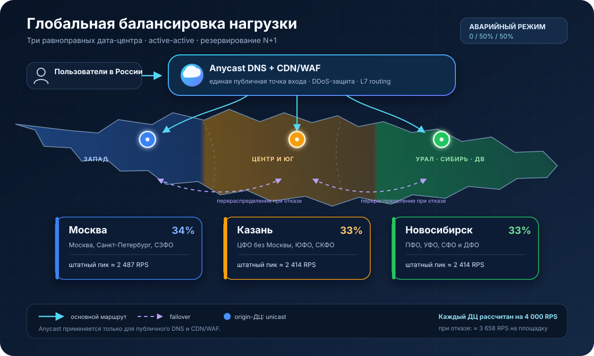

# Высоконагруженная платформа онлайн-рекрутинга для поиска работы и сотрудников

Курсовая работа по курсу «Проектирование высоконагруженных систем».

## 1. Тема и целевая аудитория

### Тема

Высоконагруженная платформа онлайн-рекрутинга для поиска работы и сотрудников. Ближайший аналог – HeadHunter

### Целевая аудитория

Основная аудитория сервиса состоит из двух групп:

- соискатели — пользователи, которые создают резюме, ищут вакансии и отправляют отклики;
- работодатели и рекрутеры — представители компаний, которые публикуют вакансии, ищут специалистов и обрабатывают отклики.

В качестве ориентира по масштабу используется hh.ru. Месячная активная аудитория платформы около 33 млн человек, общее число зарегистрированных пользователей составляет около 60 млн [[1]](#source1). География MVP — Российская Федерация. Сервис должен учитывать регион пользователя и поддерживать поиск по всей стране: открытая статистика hh.ru охватывает 84 региона России [[2]](#source2). Ядро аудитории hh.ru составляют пользователи в возрасте от 25 до 44 лет — на них приходится около 60% аудитории. Ежедневная аудитория мобильного приложения превышает 2,3 млн соискателей, а месячная — 11,2 млн [[3]](#source3).

### Функционал MVP

1. Регистрация и авторизация пользователей в роли соискателя или работодателя.
2. Создание, редактирование и публикация резюме.
3. Создание, редактирование и публикация вакансий.
4. Поиск и просмотр вакансий с фильтрацией по профессии, региону, формату работы, опыту и уровню дохода.
5. Отправка отклика на вакансию с выбором резюме.
6. Просмотр соискателем отправленных откликов и их текущих статусов.
7. Просмотр работодателем откликов и резюме кандидатов, изменение статуса отклика и отправка приглашения или отказа.

### Ключевые продуктовые решения

1. Сервис поддерживает две основные роли: соискатель работает с резюме и откликами, а работодатель с вакансиями и кандидатами.
2. Поиск вакансий выполняется по названию и описанию с возможностью фильтрации по региону, профессии, формату работы, опыту и уровню дохода. По умолчанию вакансии сортируются по дате публикации.
3. Отклик можно отправить только с опубликованным резюме. Для каждой пары «вакансия — резюме» допускается только один активный отклик.
4. Работодатель получает доступ к данным кандидата в рамках отклика и управляет воронкой подбора через статусы: «На рассмотрении», «Приглашение» и «Отказ».
5. Поиск вакансий должен поддерживать полнотекстовый поиск, фильтрацию и сортировку.

## 2. Расчёт нагрузки

Расчёт выполнен для нагрузки, сопоставимой с российским сегментом hh.ru. Публичные показатели отмечены ссылками на источники, остальные значения являются проектными допущениями.

### 2.1. Продуктовые метрики

#### Аудитория и объём контента

| Метрика | Значение | Основание |
|---|---:|---|
| Месячная аудитория (MAU) | 33 млн пользователей | Данные HeadHunter [[1]](#source1) |
| Дневная аудитория (DAU) | 6,8 млн пользователей | Расчёт по коэффициенту `DAU / MAU = 2,3 / 11,2 ≈ 20,5%` для мобильного приложения [[3]](#source3) |
| DAU соискателей | 6,46 млн пользователей | Проектное допущение: 95% DAU |
| DAU работодателей | 0,34 млн пользователей | Проектное допущение: 5% DAU |
| Зарегистрированные пользователи | 60 млн | Данные HeadHunter [[1]](#source1) |
| Новые регистрации | 33 тыс. в сутки | Проектное допущение: равномерный набор 60 млн пользователей за пять лет, `60 млн / (5 × 365)` |
| Резюме | 79,6 млн | Данные на 31 января 2026 года [[4]](#source4) |
| Зарегистрированные компании | 2,67 млн | Данные на 31 января 2026 года [[4]](#source4) |
| Одновременно активные вакансии | 778 тыс. | Данные на 31 января 2026 года [[4]](#source4) |
| Новые публикации вакансий | 25,9 тыс. в сутки | `778 367 / 30 дней`; публикация вакансии действует 30 дней [[5]](#source5) |
| Новые отклики | 620 тыс. в сутки | `25 946 × 23,9`; публичная метрика включает отклики и звонки, поэтому всё значение принято за отклики как верхняя оценка [[4]](#source4) |

Для оценки DAU отношение дневной и месячной аудитории мобильного приложения переносится на всю аудиторию сервиса. Это допущение даёт `33 млн × 20,5% ≈ 6,8 млн` активных пользователей в сутки.

Публичного распределения DAU по ролям нет. В качестве приближения использовано соотношение 60 млн зарегистрированных пользователей и 2,67 млн зарегистрированных компаний: `60 / (60 + 2,67) ≈ 95,7%` и `2,67 / (60 + 2,67) ≈ 4,3%`. Для дальнейших расчётов пропорция округлена до 95% соискателей и 5% работодателей. Компания при этом не равна отдельному аккаунту рекрутера, поэтому такое распределение является проектным допущением, а не статистикой hh.ru.

#### Действия пользователей

| Роль | Действие | В среднем на одного активного пользователя в сутки | Всего в сутки | Тип операции |
|---|---|---:|---:|---|
| Все пользователи | Авторизация или обновление сессии | 1 | 6,8 млн | Чтение + запись |
| Соискатель | Поиск вакансий и применение фильтров | 5 | 32,3 млн | Чтение |
| Соискатель | Просмотр карточки вакансии | 12 | 77,52 млн | Чтение |
| Соискатель | Создание или изменение резюме | 0,02 | 129,2 тыс. | Запись |
| Соискатель | Отправка отклика | 0,096 | 620 тыс. | Запись |
| Соискатель | Просмотр списка своих откликов | 1 | 6,46 млн | Чтение |
| Работодатель | Создание или изменение вакансии | 0,15 | 51,9 тыс. | Запись |
| Работодатель | Просмотр списка входящих откликов | 5 | 1,7 млн | Чтение |
| Работодатель | Просмотр резюме из отклика | 1,28 | 434 тыс. | Чтение |
| Работодатель | Изменение статуса отклика | 1,09 | 372 тыс. | Запись |

Частота поисков и просмотров является проектным допущением. Предполагается, что работодатель просматривает 70% поступивших резюме и изменяет статус у 60% откликов.

#### Средний объём данных пользователя

В MVP резюме, вакансии и отклики хранятся как структурированный текст. Загрузка портфолио, видео и других тяжёлых вложений не предусмотрена.

| Сущность соискателя | Среднее количество | Размер одной записи | Объём на пользователя |
|---|---:|---:|---:|
| Учётная запись и профиль | 1 | 2 Кбайт | 0,000002 Гбайт |
| Резюме | 1,33 | 15 Кбайт | 0,000020 Гбайт |
| Отклики за пять лет | 18,9 | 1 Кбайт | 0,000019 Гбайт |
| **Итого** | — | — | **0,000041 Гбайт** |

Среднее количество резюме на одного соискателя рассчитано как `79,6 млн / 60 млн ≈ 1,33`. За пять лет в системе накапливается около 1,13 млрд откликов, поэтому на одного зарегистрированного пользователя приходится `1,13 млрд / 60 млн ≈ 18,9` отклика. Таким образом, средний логический объём данных одного соискателя без файлов и поисковых индексов составляет около 0,000041 Гбайт, или 41 Кбайт.

Для работодателей объём данных оценивается на одну зарегистрированную компанию.

| Сущность работодателя | Среднее количество | Размер одной записи | Объём на компанию |
|---|---:|---:|---:|
| Карточка компании | 1 | 4 Кбайт | 0,000004 Гбайт |
| Вакансии за пять лет | 18 | 10 Кбайт | 0,000180 Гбайт |
| Полученные отклики за пять лет | 423 | 1 Кбайт | 0,000423 Гбайт |
| **Итого** | — | — | **0,000607 Гбайт** |

Среднее количество вакансий на одну компанию рассчитано как `48,1 млн / 2,67 млн ≈ 18`. За пять лет в системе накапливается около 1,13 млрд откликов, поэтому на одну зарегистрированную компанию приходится `1,13 млрд / 2,67 млн ≈ 423` отклика. Таким образом, средний логический объём данных одной компании без файлов и поисковых индексов составляет около 0,000607 Гбайт, или 607 Кбайт.

### 2.2. Технические метрики

#### Хранилище

Для исторических вакансий и откликов принят горизонт хранения пять лет. В таблице указан логический объём без репликации, резервных копий и служебных данных СУБД.

| Тип данных | Количество объектов | Средний размер объекта | Объём |
|---|---:|---:|---:|
| Пользователи | 60 млн | 2 Кбайт | 0,120 Тбайт |
| Резюме | 79,6 млн | 15 Кбайт | 1,194 Тбайт |
| Компании | 2,67 млн | 4 Кбайт | 0,011 Тбайт |
| Активные и исторические вакансии за пять лет | 48,1 млн | 10 Кбайт | 0,481 Тбайт |
| Отклики за пять лет | 1,13 млрд | 1 Кбайт | 1,132 Тбайт |
| Поисковый индекс активных вакансий | 778 тыс. документов | 8 Кбайт | 0,006 Тбайт |
| **Итого** | — | — | **2,94 Тбайт** |

Количество вакансий за пять лет рассчитано как `778 367 + 25 946 × 365 × 5 ≈ 48,1 млн`, количество откликов — как `620 099 × 365 × 5 ≈ 1,13 млрд`. Физический объём с учётом репликации, индексов СУБД и резервных копий будет рассчитан при проектировании физической схемы данных.

#### RPS

Средний RPS рассчитывается по формуле `количество операций в сутки / 86 400`. Для расчёта пикового RPS принято, что основная активность пользователей приходится на 12 дневных часов. Поэтому нагрузка в активный период в среднем в `24 / 12 = 2` раза выше среднесуточной. Внутри активного периода для наиболее загруженного часа дополнительно принят коэффициент `2,5`. Итоговый коэффициент пиковой нагрузки составляет `K = 2 × 2,5 = 5`. Таким образом, пиковый RPS рассчитывается по формуле `средний RPS × 5`. Значения 12 часов и коэффициент 2,5 являются проектными допущениями.

| Тип запроса | Запросов в сутки | Средний RPS | Пиковый RPS |
|---|---:|---:|---:|
| Регистрация | 33 тыс. | 0,4 | 2 |
| Авторизация и обновление сессии | 6,8 млн | 79 | 394 |
| Поиск вакансий | 32,3 млн | 374 | 1 869 |
| Просмотр вакансии | 77,52 млн | 897 | 4 486 |
| Создание или изменение резюме | 129,2 тыс. | 1,5 | 7 |
| Отправка отклика | 620 тыс. | 7,2 | 36 |
| Просмотр своих откликов | 6,46 млн | 75 | 374 |
| Создание или изменение вакансии | 51,9 тыс. | 0,6 | 3 |
| Просмотр входящих откликов | 1,7 млн | 19,7 | 98 |
| Просмотр резюме кандидата | 434 тыс. | 5,0 | 25 |
| Изменение статуса отклика | 372 тыс. | 4,3 | 22 |
| **Итого** | **126,4 млн** | **1 463** | **7 316** |

#### Сетевой трафик

Размер ответа поиска включает одну страницу из 20 кратких описаний вакансий. Размер карточек включает структурированные данные и текст, но не включает статические ресурсы приложения, которые предполагается отдавать через CDN и кеш браузера.

| Тип трафика | Средний объём запроса и ответа | Объём в сутки | Пиковая пропускная способность |
|---|---:|---:|---:|
| Регистрация | 5 Кбайт | 0,2 Гбайт | <0,001 Гбит/с |
| Авторизация и сессии | 3 Кбайт | 20,4 Гбайт | 0,009 Гбит/с |
| Поисковая выдача вакансий | 50 Кбайт | 1 615 Гбайт | 0,748 Гбит/с |
| Карточки вакансий | 25 Кбайт | 1 938 Гбайт | 0,897 Гбит/с |
| Создание и изменение резюме | 15 Кбайт | 1,9 Гбайт | 0,001 Гбит/с |
| Отклики | 3 Кбайт | 1,9 Гбайт | 0,001 Гбит/с |
| Списки откликов соискателя | 30 Кбайт | 193,8 Гбайт | 0,090 Гбит/с |
| Создание и изменение вакансий | 15 Кбайт | 0,8 Гбайт | <0,001 Гбит/с |
| Списки откликов работодателя | 40 Кбайт | 68 Гбайт | 0,031 Гбит/с |
| Просмотр резюме работодателем | 25 Кбайт | 10,9 Гбайт | 0,005 Гбит/с |
| Изменение статусов откликов | 2 Кбайт | 0,7 Гбайт | <0,001 Гбит/с |
| **Итого без запаса** | — | **3 852 Гбайт/сутки** | **1,78 Гбит/с** |
| **Итого с коэффициентом запаса 1,3** | — | **5 007 Гбайт/сутки** | **2,32 Гбит/с** |

Сетевой трафик рассчитан на границе backend API. Трафик между внутренними сервисами, репликация данных и резервное копирование в эту оценку не входят.
В расчётах используются десятичные единицы: `1 Кбайт = 10³ байт`, `1 Гбайт = 10⁹ байт`, `1 Тбайт = 10¹² байт`.

## 3. Глобальная балансировка нагрузки

### 3.1. Расположение дата-центров

Сервис развёрнут в трёх географически разнесённых дата-центрах России: Москве, Казани и Новосибирске. Все площадки работают одновременно по схеме active-active и имеют одинаковую вычислительную конфигурацию.



| Дата-центр | Обслуживаемые регионы | Нормальная доля нагрузки |
|---|---|---:|
| Москва | Москва, Санкт-Петербург и Северо-Западный ФО | 34% |
| Казань | Центральный ФО без Москвы, Южный ФО, Северо-Кавказский ФО и часть Приволжского ФО | 33% |
| Новосибирск | Часть Приволжского ФО, Уральский, Сибирский и Дальневосточный ФО | 33% |

Москва обслуживает крупнейшие центры аудитории и северо-запад европейской части России. Казань принимает трафик Центрального, Южного и части Приволжского федеральных округов, за счёт чего разгружает московскую площадку. Новосибирск сокращает сетевую задержку для Урала, Сибири и Дальнего Востока.

Три ДЦ — минимальная конфигурация, при которой отказ одной площадки не переносит всю нагрузку на единственный оставшийся ДЦ. Размещение отдельных площадок в Санкт-Петербурге и Владивостоке привело бы к их недозагрузке: соответствующие региональные доли недостаточны для равномерного распределения между четырьмя или пятью одинаковыми ДЦ. При этом Санкт-Петербург имеет приемлемую связность с Москвой, а трафик Дальнего Востока обслуживается Новосибирском и ближайшими узлами CDN.

### 3.2. Оценка географического распределения

В качестве показателя регионального спроса используется среднее арифметическое долей активных вакансий и активных резюме hh.ru за январь 2026 года [[4]](#source4). Из-за округления исходных значений сумма средних долей составляет 100,5%.

| Регион | Активные вакансии | Активные резюме | Средняя доля | Дата-центр |
|---|---:|---:|---:|---|
| Москва | 19% | 22% | 20,5% | Москва |
| Санкт-Петербург | 8% | 9% | 8,5% | Москва |
| Северо-Западный ФО без Санкт-Петербурга | 5% | 4% | 4,5% | Москва |
| Центральный ФО без Москвы | 20% | 15% | 17,5% | Казань |
| Южный ФО | 8% | 9% | 8,5% | Казань |
| Северо-Кавказский ФО | 1% | 2% | 1,5% | Казань |
| Приволжский ФО | 16% | 17% | 16,5% | Казань и Новосибирск |
| Уральский ФО | 9% | 8% | 8,5% | Новосибирск |
| Сибирский ФО | 10% | 11% | 10,5% | Новосибирск |
| Дальневосточный ФО | 4% | 4% | 4% | Новосибирск |

Без нормализации на московскую площадку приходится 33,5%, на казанскую — 27,5% и часть трафика Приволжского ФО, на новосибирскую — 23% и оставшаяся часть трафика Приволжского ФО. Веса для Приволжского ФО подбираются по сетевой задержке и текущей загрузке так, чтобы итоговое распределение было близко к `34% / 33% / 33%`.

Предполагается, что соотношение типов запросов одинаково во всех регионах. Поэтому каждый тип трафика распределяется между ДЦ в той же пропорции.

### 3.3. Схема прохождения трафика

Для пользовательского трафика используются три домена:

- `www.<домен>` — веб-интерфейс;
- `api.<домен>` — backend API веб-приложения и мобильных клиентов;
- `static.<домен>` — статические файлы, обслуживаемые CDN.

```text
Пользователь
    ↓
Рекурсивный DNS
    ↓
Anycast authoritative DNS с DNSSEC
    ↓
Ближайший узел CDN/WAF
    ↓
Выбор здорового origin-ДЦ по GeoIP, задержке и весу
    ↓
Backend выбранного ДЦ
```

Authoritative DNS и публичный CDN/WAF используют Anycast: один и тот же сервисный IP-префикс анонсируется из нескольких сетевых узлов, а BGP направляет пользователя к топологически ближайшему узлу [[6]](#source6). Зоны `www` и `api` подписываются DNSSEC, чтобы обеспечить проверку происхождения и целостности DNS-ответов [[7]](#source7).

Публичные домены возвращают адреса Anycast-узлов CDN/WAF. Адреса origin-ДЦ являются обычными unicast-адресами, не публикуются в пользовательском DNS и принимают соединения только от доверенных публичных прокси. Благодаря этому смена origin-ДЦ выполняется прокси без ожидания обновления DNS-кеша пользователя.

### 3.4. Распределение нагрузки по дата-центрам

В штатном режиме площадки загружены практически равномерно. При отказе одного ДЦ его доля делится поровну между двумя оставшимися площадками.

| Состояние | Москва | Казань | Новосибирск |
|---|---:|---:|---:|
| Все ДЦ работают | 34% | 33% | 33% |
| Недоступна Москва | 0% | 50% | 50% |
| Недоступна Казань | 50% | 0% | 50% |
| Недоступен Новосибирск | 50% | 50% | 0% |

Распределение пикового RPS из раздела 2 рассчитывается по формулам:

```text
RPS Москвы = пиковый RPS метода × 0,34
RPS Казани = пиковый RPS метода × 0,33
RPS Новосибирска = пиковый RPS метода × 0,33
```

| Тип запроса | Общий пиковый RPS | Москва, 34% | Казань, 33% | Новосибирск, 33% |
|---|---:|---:|---:|---:|
| Регистрация | 2 | 0,68 | 0,66 | 0,66 |
| Авторизация и обновление сессии | 394 | 133,96 | 130,02 | 130,02 |
| Поиск вакансий | 1 869 | 635,46 | 616,77 | 616,77 |
| Просмотр вакансии | 4 486 | 1 525,24 | 1 480,38 | 1 480,38 |
| Создание или изменение резюме | 7 | 2,38 | 2,31 | 2,31 |
| Отправка отклика | 36 | 12,24 | 11,88 | 11,88 |
| Просмотр своих откликов | 374 | 127,16 | 123,42 | 123,42 |
| Создание или изменение вакансии | 3 | 1,02 | 0,99 | 0,99 |
| Просмотр входящих откликов | 98 | 33,32 | 32,34 | 32,34 |
| Просмотр резюме кандидата | 25 | 8,50 | 8,25 | 8,25 |
| Изменение статуса отклика | 22 | 7,48 | 7,26 | 7,26 |
| **Итого** | **7 316** | **2 487,44** | **2 414,28** | **2 414,28** |

Для расчёта мощности значения округляются с запасом:

| Метрика | Вся система | Один ДЦ в штатном режиме | Один ДЦ при отказе соседнего |
|---|---:|---:|---:|
| Средний RPS | 1 463 | около 488 | около 732 |
| Пиковый RPS | 7 316 | около 2 440 | 3 658 |
| Пиковый сетевой трафик с запасом | 2,32 Гбит/с | около 0,77 Гбит/с | 1,16 Гбит/с |

Каждый ДЦ проектируется минимум на 50% суммарной нагрузки: `7 316 × 0,5 = 3 658 RPS`. Расчётная производительность округляется до 4 000 RPS на площадку. При штатной нагрузке 2 440 RPS это соответствует примерно 61% расчётной мощности. Если считать только обязательную для отказа мощность 3 658 RPS, её штатная утилизация составляет около 67%.

### 3.5. Механизмы балансировки и аварийного переключения

CDN/WAF завершает TLS-соединения, фильтрует DDoS- и прикладные атаки, применяет rate limiting, кеширует статический контент и проксирует динамические запросы в выбранный origin-ДЦ. Начальная группа определяется по IP-геобазе. Затем выбор корректируется с учётом доступности площадки, сетевой задержки и её текущего веса.

IP-геолокация может быть неточной для пользователей VPN, корпоративных прокси и CGNAT. Поэтому GeoIP используется только как начальный сигнал, а не как жёсткая привязка. Если DNS-балансировщику доступна информация EDNS Client Subnet, она позволяет учитывать сеть клиента, а не только адрес рекурсивного резолвера, однако её использование должно быть ограничено из-за влияния на приватность и размер DNS-кеша [[8]](#source8).

Для обнаружения отказов выполняются HTTPS health checks из трёх независимых сетевых точек каждые 5 секунд. ДЦ исключается из балансировки после трёх последовательных неудачных проверок, то есть примерно через 15 секунд. Значение TTL публичных DNS-записей составляет 60 секунд, но переключение между origin-ДЦ выполняется на L7-прокси сразу после отрицательного health check и не зависит от истечения TTL.

После восстановления трафик возвращается постепенно: `10% → 25% → 50% → штатный вес`. Между этапами проверяются частота ошибок, задержка и загрузка площадки. Это предотвращает перегрузку восстановленного ДЦ и резкий рост запросов при холодных кешах.

Backend-узлы не хранят пользовательские сессии локально. Подписанные токены авторизации проверяются в любом ДЦ. Для записывающих операций, которые клиент или прокси может повторить после сетевой ошибки, используется idempotency key, предотвращающий создание дублирующих откликов, резюме и вакансий.

### 3.6. Использование Anycast и отклонённые варианты

BGP Anycast используется только для authoritative DNS и публичного CDN/WAF. Собственная общая origin-подсеть из трёх ДЦ не анонсируется: BGP выбирает маршрут по сетевой топологии и политикам автономных систем, но не учитывает состояние backend-приложения, заполнение очередей и требуемую долю нагрузки. Управление origin-трафиком выполняется на прикладном уровне публичного прокси.

| Вариант | Причина отказа |
|---|---|
| Прямой GeoDNS на публичные адреса ДЦ | Переключение зависит от TTL и DNS-кешей, origin-адреса открыты для прямых атак |
| Собственный BGP Anycast между origin-ДЦ | Сложное сетевое управление и недостаточный контроль прикладной нагрузки |
| Один ДЦ | Нет географического резервирования; отказ приводит к полной недоступности сервиса |
| Два ДЦ | При отказе одной площадки вторая должна принять 100% нагрузки, штатная загрузка или запас мощности получаются неэффективными |
| Четыре и более одинаковых ДЦ | Санкт-Петербург и Дальний Восток не создают достаточную долю нагрузки для равномерной загрузки дополнительных площадок |

### 3.7. Допущения

- сервис работает на территории Российской Федерации;
- географическая нагрузка оценивается через распределение активных вакансий и резюме hh.ru;
- структура запросов пользователей считается одинаковой во всех регионах;
- все три ДЦ имеют одинаковую вычислительную конфигурацию;
- штатная схема выдерживает потерю одного ДЦ без ограничения функциональности;
- потеря двух ДЦ считается аварийным режимом, в котором допускается ограничение тяжёлых операций;
- распределение аудитории и интенсивность запросов считаются стабильными на горизонте расчёта.

## Список источников

<a id="source1"></a>
1. [HeadHunter — информация для инвесторов](https://investor.hh.ru/ru)

<a id="source2"></a>
2. [Статистика рынка труда hh.ru](https://hh.ru/article/index)

<a id="source3"></a>
3. [Новые возможности медийной рекламы на hh.ru: охваты и форматы](https://hh.ru/blog/medijnaya-reklama-na-hh-ru)

<a id="source4"></a>
4. [Краткий обзор рынка труда hh.ru за январь 2026 года](https://stats.hh.ru/api/v1/monthly-report/f-1af62a02-5e78-46d4-9353-6b70e414b65c)

<a id="source5"></a>
5. [Условия оказания услуг hh.ru](https://hh.ru/article/34359)

<a id="source6"></a>
6. [RFC 4786 — Operation of Anycast Services](https://www.rfc-editor.org/info/rfc4786/)

<a id="source7"></a>
7. [RFC 4033 — DNS Security Introduction and Requirements](https://www.rfc-editor.org/info/rfc4033/)

<a id="source8"></a>
8. [RFC 7871 — Client Subnet in DNS Queries](https://www.rfc-editor.org/info/rfc7871/)
